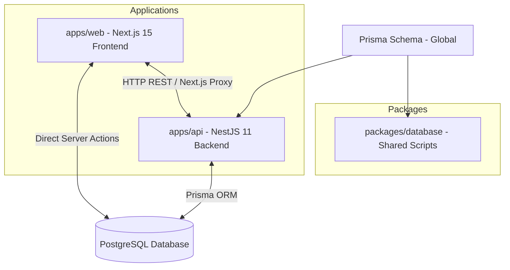

# ETHShala - Repository Context & Architecture Guide

This document provides a comprehensive technical overview of the **ETHShala** repository, mapping out its architecture, database design, key workflows, security posture, and developer commands. It serves as a single source of truth for developers and AI agents working on this codebase.

---

## 1. Project Overview & Mission

**ETHShala** is a full-stack, gamified learning management system (LMS) designed to educate developers and Web3 enthusiasts on **Ethereum Improvement Proposals (EIPs)**. 

### Core Value Propositions:
*   **Structured Learning:** Modular path covering foundational and advanced EIPs.
*   **Gamification:** Interactive assignment submissions, XP-points system, and physical/digital reward redemptions.
*   **Community Expansion:** Built-in Campus Ambassador Program (CAP) application portal and double-sided referral incentive loops.
*   **Web3 Integration:** Native wallet connection supporting EIP-712 signing, network switching, and protocol interactions.

---

## 2. Monorepo Architecture

The repository is structured as a monorepo managed via **Turborepo** and **pnpm** workspaces.



### Monorepo Structure:
*   **`apps/web` (Next.js 15):** The user-facing frontend application built using the App Router, React 18, and Tailwind CSS 4.
*   **`apps/api` (NestJS 11):** The core backend service responsible for business logic, database mutations, validations, and administrative actions.
*   **`packages/database`:** Houses database utility scripts (e.g., role updates, administrative overrides).
*   **`prisma/` (Root):** Global directory housing the master `schema.prisma` file, ensuring a single schema definition is shared and generated across both applications.

---

## 3. Technology Stack

### Frontend (`apps/web`):
*   **Framework:** Next.js 15 (App Router, Strict TypeScript)
*   **Styling:** Tailwind CSS 4 + Vanilla CSS variables for custom styling/animations
*   **Authentication:** Better Auth (Client-side & Server-side middleware protection)
*   **Web3 Integration:** Wagmi 2.x, RainbowKit 2.x, Viem 2.x
*   **Icons:** Lucide React
*   **Notification:** Sonner (Global toasts)

### Backend (`apps/api`):
*   **Framework:** NestJS 11 (Controllers, Services, Modules, DTOs)
*   **ORM:** Prisma Client (v6.x)
*   **Validation:** `class-validator`, `class-transformer` (Strict global pipe configuration)
*   **Security:** Helmet (HTTP Header protection), Throttler (IP-based rate limiting)

---

## 4. Database Schema (Prisma)

The PostgreSQL database schema is defined globally in `prisma/schema.prisma`. Below is the logical breakdown of the entity relationships:

### Core Tables & Enums:

#### Users & Authentication:
*   **`User`:** The central user entity. Fields include `email`, `username`, `walletAddress`, and `role` (Enum: `STUDENT`, `AMBASSADOR`, `MENTOR`, `ADMIN`).
*   **`Profile`:** Extends `User` with demographic metadata (college, graduation year, social links, biography, avatar URL).
*   **`Session` & `Account` & `Verification`:** Standard Better Auth integration schemas for secure authentication, token management, and social logins (Google/GitHub).

#### Gamification & LMS:
*   **`Module`:** Learning modules containing metadata (category, difficulty, duration, price, XP reward, premium status).
*   **`ModuleSubscription`:** Tracks which users are enrolled in premium or beginner modules.
*   **`Lesson`:** Content pages belonging to a specific module.
*   **`LessonProgress`:** Tracks individual lesson completion states. A module is considered fully complete only when all lessons and associated assignments are finished.
*   **`Assignment`:** Projects or challenges tied to a module, containing instructions, estimated time, XP rewards, deadlines, and tag metadata.
*   **`AssignmentSubmission`:** Stores student solutions, progress states (Enum: `NOT_STARTED` to `COMPLETED`), scores, and mentor feedback.
*   **`XPTransaction`:** Immutable ledger records capturing all XP additions (e.g., lesson completions, graded assignments, referral bonuses) or deductions.

#### Campus Ambassadors & Referrals:
*   **`CAPApplication`:** Captures student applications to the Campus Ambassador Program (status tracked via Enum: `PENDING`, `UNDER_REVIEW`, `APPROVED`, `REJECTED`).
*   **`ReferralCode` & `Referral`:** Standardized referral engine tracking clicks, referred sign-ups, and double-sided XP bonuses.

#### Rewards & Economy:
*   **`Reward`:** Catalog of redeemable goods (swag, tickets, NFTs) with XP costs.
*   **`RewardRedemption`:** Tracks user purchases and transactions from the Reward Store.

---

## 5. Routing & Security Strategy

To ensure production-grade security, communication between the Next.js frontend and NestJS backend is decoupled and secured via a multi-layered gatekeeping strategy.

```
[Client Browser]
       │
       ▼ (User Session)
[Next.js Server (apps/web)] ───► /api/admin/* (Route Handlers)
       │                              │
       │ (Direct DB Query)            │ (Attaches INTERNAL_API_KEY)
       ▼                              ▼
[PostgreSQL Database]          [NestJS API (apps/api)] ──► Global ApiKeyGuard
```

### 1. Global NestJS ApiKeyGuard
The backend API (`apps/api`) registers a global `ApiKeyGuard` in its root module. 
*   Every request entering the NestJS backend must contain a valid `x-api-key` header matching `process.env.INTERNAL_API_KEY`.
*   This prevents arbitrary public access to NestJS endpoints.

### 2. Next.js Server-Side API Proxies
Since the `INTERNAL_API_KEY` must never be exposed to the client browser:
*   All sensitive/administrative frontend operations query local Next.js Route Handlers (e.g., `/api/admin/applications`, `/api/admin/upload`).
*   These Route Handlers verify the user's session role (using Better Auth server-side verification).
*   If the user has administrative privileges, the Route Handler uses a secure, server-side helper (`apiFetch`) to query the NestJS API, automatically injecting the `INTERNAL_API_KEY` header.

### 3. CORS & Allowed Origins
The NestJS API strictly validates incoming request origins against a comma-separated list of values configured via the `CORS_ORIGIN` environment variable. This allows the API to safely handle simultaneous traffic from localhost, Vercel deployments, and the custom production domain.

---

## 6. Development & Operations Guide

### Prerequisites
*   **Node.js:** v20+ (LTS recommended)
*   **Package Manager:** `pnpm` (v10+)
*   **Database:** PostgreSQL instance

### Environment Variable Requirements

Create `.env` files in the root, `apps/web`, and `apps/api` using the following schemas:

#### Backend (`apps/api/.env`)
```env
PORT=4000
DATABASE_URL="postgresql://<user>:<password>@localhost:5432/<database>?schema=public"
INTERNAL_API_KEY="your-secure-internal-api-key"
CORS_ORIGIN="http://localhost:3000,https://ethshala.vercel.app,https://ethshala.com"
```

#### Frontend (`apps/web/.env`)
```env
DATABASE_URL="postgresql://<user>:<password>@localhost:5432/<database>?schema=public"
NEXT_PUBLIC_API_URL="http://127.0.0.1:4000" # Self-hosted NestJS URL
INTERNAL_API_KEY="your-secure-internal-api-key" # Must match apps/api/.env
BETTER_AUTH_SECRET="long-secure-session-secret"
BETTER_AUTH_URL="http://localhost:3000" # Localhost or production domain
NEXT_PUBLIC_WALLETCONNECT_PROJECT_ID="your-walletconnect-id"
```

---

## 7. Core Developer Commands

Run all commands from the repository root:

### Installation & Builds:
*   **Install Dependencies:** `pnpm install`
*   **Build Whole Project:** `pnpm build`
*   **Lint All Files:** `pnpm lint`
*   **Run Tests:** `pnpm test`

### Running Applications:
*   **Start All Services:** `pnpm dev`
*   **Start Web Only:** `pnpm dev:web`
*   **Start API Only:** `pnpm dev:api`

### Database Management (Prisma):
*   **Generate Clients:** `pnpm exec prisma generate --schema=prisma/schema.prisma`
*   **Push Schema to DB:** `pnpm exec prisma db push --schema=prisma/schema.prisma`
*   **Open Prisma Studio:** `pnpm exec prisma studio --schema=prisma/schema.prisma`
*   **Make User an Admin:** `pnpm --filter database ts-node update_admin.ts <userId>`

---

## 8. Recent Production Polish & Security Hardening

The repository has recently undergone extensive security hardening and architectural Polish to ensure production-grade stability:

1.  **Elimination of Hardcoded Backdoors:** Removed a hardcoded user ID check (`user_3EFohPWsEpwDDfFQxcf3i1T39pJ`) that was bypassing admin checks across 11 frontend files. Administration is now strictly role-based.
2.  **CORS Multihost Support:** Fixed NestJS CORS config to support arrays of origins (split from comma-separated `CORS_ORIGIN` env values).
3.  **Connection Pool Protection:** Refactored server-side auth configuration to reuse the global singleton `PrismaClient` rather than instantiating new clients, preventing PostgreSQL pool exhaustion.
4.  **Metadata Base Resolution:** Set `metadataBase` in the Next.js root layout to eliminate warnings and ensure absolute URLs for OpenGraph/Twitter social media sharing.
5.  **Dynamic Environment Routing:** Replaced hardcoded API URL strings with unified, fallback-supported environment variables (`NEXT_PUBLIC_API_URL` / `API_URL` / `NEXT_PUBLIC_API_BASE`).
